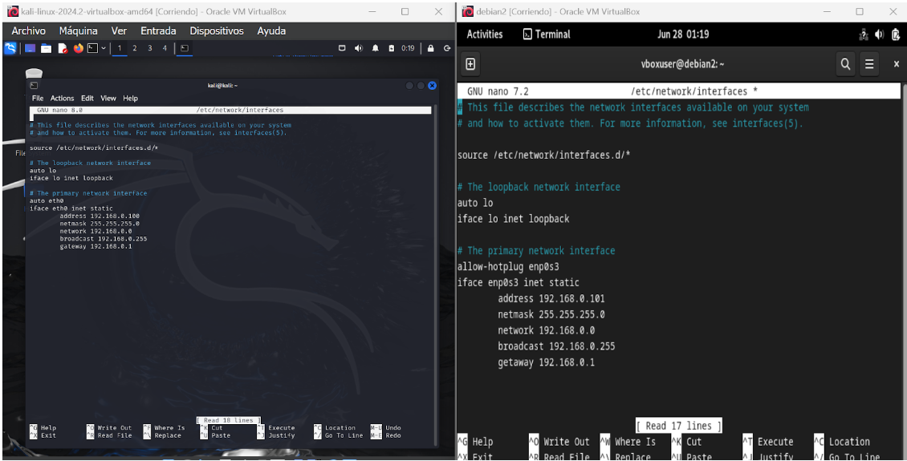
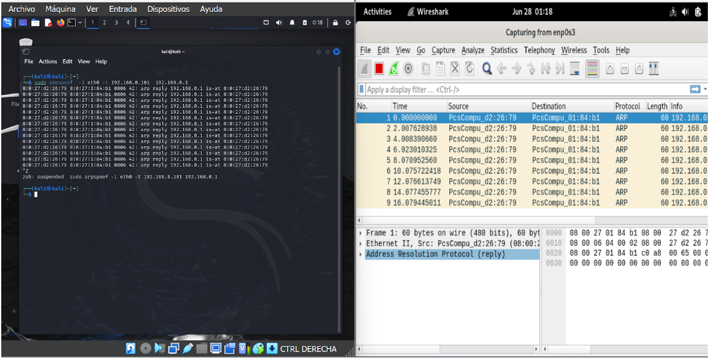
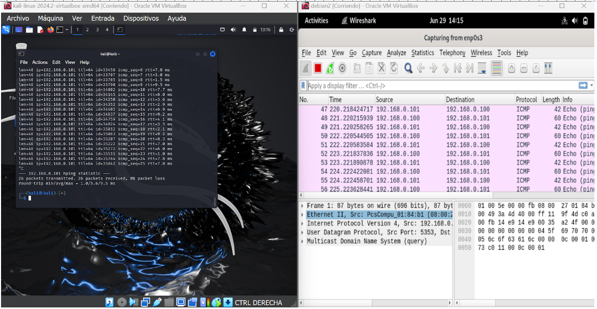

# Spoofing y DoS a un sitio web

Esta práctica te permitirá entender mejor las técnicas de spoofing y DDoS, así como sus efectos en un entorno web. 


<!-- hide -->

> By [@rosinni](https://github.com/rosinni) and [other contributors](https://github.com/4GeeksAcademy/deploying-wordpress-debian/graphs/contributors) at [4Geeks Academy](https://4geeksacademy.co/)

[](https://4geeks.com)
[](https://twitter.com/4geeksacademy)

*These instructions are [available in english](https://github.com/breatheco-de/spoofing-and-DDoS-lab/blob/main/README.md)*
<!-- endhide -->


<!-- hide -->


### Antes de empezar...

> ¡Te necesitamos! Estos ejercicios se crean y mantienen en colaboración con personas como tú. Si encuentras algún error o falta de ortografía, contribuye y/o repórtalo.

<!-- endhide -->

## 🌱 ¿Cómo empezar este proyecto?

### Instalación local:

Clona el repositorio en tu ambiente local [repositorio](https://github.com/breatheco-de/spoofing-and-DDoS-lab) y sigue las instrucciones en el archivo readme.


### Requisitos

Para esta práctica específica de Spoofing y DoS, lo mejor sería configurar la red como Red Interna. Esto es debido a varias razones:

**Aislamiento Completo:** Asegura que las actividades de ataque y prueba no interfieran con la red de producción ni con otras redes externas. Esto evita cualquier posible impacto no deseado en otros sistemas.

**Entorno Controlado:** Permite tener un control completo sobre el entorno de red, facilitando el monitoreo y la análisis del tráfico de red generado durante las pruebas.

**Simulación Realista:** Aunque se encuentra aislada, una red interna puede simular de manera efectiva un entorno de red real para las prácticas de Spoofing y DoS.


* Oracle VirtualBox
* Máquina virtual con Kali Linux (Atacante)
* Máquina virtual con Debian (Servidor Web): Donde tenemos alojado el servidor Apache y el sitio WordPress.
* Herramientas de spoofing y DDoS instaladas en máquinas virtuales.
* Un entorno de red aislado.
* Herramientas Necesarias?

## 📝 Instrucciones

### Paso 1: Configurar la Red en VirtualBox

#### Configurar la Red de la Máquina Debian (Servidor Web):
* Abre VirtualBox.
* Selecciona tu máquina virtual con Debian y haz clic en "Configuración".
* Ve a la sección "Red".
* Configura el "Adaptador 1" como "Red Interna" (Internal Network).
* En el campo "Nombre", escribe un nombre para la red interna, por ejemplo, "LabNetwork".
* Inicia la máquina, y verifica la interfaz de red disponible y sus configuraciones actuales usando el siguiente comando en la terminal:
````bash
ip addr show
````
> ***Por lo general, encontrarás líneas etiquetadas como eth0, enp0s3, wlan0, etc. La que esté activa y tenga una dirección IP asignada será la interfaz que estás utilizando.***
*  Configuración Manual de IPs para usar la red interna en el Archivo `/etc/network/interfaces` con el siguiente comando:
```bash
sudo nano /etc/network/interfaces
```
* Agrega lo siguiente en el archivo que se abre:

```plaintext:
auto enp0s3
iface enp0s3 inet static
    			address 192.168.1.10
    			netmask 255.255.255.0
    			gateway 192.168.1.1
```

* Guarda los cambios y cierra la ventana de configuración.


*Ejemplo de configuración de ambos archivos (Kali y Debian), puede contener más comandos de los mostrados, pero agrega los que hagan falta de la configuración anteriormente proporcionada, pues serán necesarios.*

* Reinicia el servicio de red:

```bash
sudo systemctl restart networking
```
* Vuelve a usar el comando  `ip addr show` y verifica que tu dirección IP sea la que configuraste en address.


#### Configurar la Red de la Máquina Kali Linux (Atacante):
* Selecciona tu máquina virtual con Kali Linux y haz clic en "Configuración".
* Ve a la sección "Red".
* Configura el "Adaptador 1" como "Red Interna" (Internal Network).
* En el campo "Nombre", selecciona el mismo nombre de red interna que utilizaste para la máquina Debian ("LabNetwork").
* Inicia la máquina, y verifica la interfaz de red disponible y sus configuraciones actuales usando el siguiente comando en la terminal:
````bash
ip addr show
````
> ***Por lo general, encontrarás líneas etiquetadas como eth0, enp0s3, wlan0, etc. La que esté activa y tenga una dirección IP asignada será la interfaz que estás utilizando.***
*  Configuración Manual de IPs para usar la red interna en el Archivo `/etc/network/interfaces` con el siguiente comando:
```bash
sudo nano /etc/network/interfaces
```
* Agrega lo siguiente en el archivo que se abre:

```plaintext:
auto eth0
iface eth0 inet static
    			address 192.168.1.11
    			netmask 255.255.255.0
    			gateway 192.168.1.1
```

* Guarda los cambios y cierra la ventana de configuración.
* Reinicia el servicio de red:

```bash
sudo systemctl restart networking
```
* Vuelve a usar el comando  `ip addr show` y verifica que tu dirección IP sea la que configuraste en address.


### PASO 2: Verificar la Conexión Entre las Máquinas

#### Desde la Máquina Kali Linux (Atacante):
* Abre una terminal y haz ping a la máquina Debian para verificar la conexión:

```bash
$ ping <IP_debian>
```

> Reemplaza <IP_debian> con la dirección IP que obtuviste para la máquina Debian.

#### Desde la Máquina Debian (Servidor Web):
* Abre una terminal y haz ping a la máquina Kali Linux para verificar la conexión:

```bash
$ ping <IP_kali>
```

> Reemplaza <IP_kali> con la dirección IP que obtuviste para la máquina Kali.

Ejemplo gráfico de cómo se ven los ping al estar conectados


### PASO 3:Práctica de ARP Spoofing

Para llevar a cabo esta práctica vamos a utilizar `arpspoof` esta herramienta se utiliza para enviar paquetes ARP falsificados a la red y hacer que un dispositivo (como la máquina Debian) crea que la dirección MAC del atacante (Kali Linux) es la dirección MAC del gateway (router). Esto puede verificarse observando las tablas ARP en la máquina Debian antes y después de ejecutar `arpspoof`.

#### En la Máquina Kali Linux (Atacante):
* Instalación de arspoof:
```bash
sudo apt update
sudo apt install dsniff
```
> ***Nota: arpspoof forma parte del paquete dsniff.***
 * Verificar si se instaló arpspoof
 ```bash
sudo arpspoof -h
```

* Ejecuta arpspoof para envenenar las tablas ARP de la máquina Debian y del gateway:
```bash
sudo arpspoof -i <interfaz_kali> -t <IP_debian> <gateway>
```
* -i <interfaz_kali>: Especifica la interfaz de red desde donde se enviarán los paquetes ARP ejemplo eth0.
* -t <IP_debian>: Especifica la dirección IP de la víctima (la máquina Debian en este caso).
* <gateway>: Especifica la dirección IP del gateway. (la configuramos inicialmente en el archivo /etc/network/interfaces, es la misma para ambas máquinas)

#### Monitorear con Wireshark en la Máquina Debian (Servidor Web):

Wireshark es ideal para analizar el tráfico de red, identificar posibles ataques y monitorear la seguridad en un entorno de red.

* Instalación de wireshark:
```bash
sudo apt update
sudo apt install wireshark
```
Durante la instalación, es posible que se pregunte si los usuarios no root deben ser capaces de capturar paquetes. Selecciona "Sí" Si ya completaste la instalación sin esta configuración, puedes hacerlo posteriormente con:

```bash
sudo dpkg-reconfigure wireshark-common
```
* Luego, agrega tu usuario al grupo wireshark:
```bash
sudo usermod -aG wireshark $USER
```
> ***NOTA:*** $USER es el nombre de usuario que utilizas en la máquina virtual Debian.
Una vez completada la instalación, cierra y vuelve a iniciar sesión para aplicar los cambios de grupo. puedes iniciar Wireshark ejecutando

```bash
sudo wireshark
```

### Monitoreo y Análisis

* Con wireshark abierto haz clic en el botón de "play" para comenzar a capturar paquetes.
* Aplica filtros para enfocarte en los tipos específicos de tráfico, como arp, tcp, udp, etc.




### PASO 4: DoS - práctica ICMP Flood 

Para realizar un ataque de flooding ICMP (ping flood) desde Kali a Debian, puedes usar el siguiente comando:

```bash
sudo hping3 -1 <IP_debian> -I eth0
```

* hping3: Es una herramienta de línea de comandos para la generación de paquetes TCP/IP que se puede utilizar para varias pruebas de red, incluyendo análisis de puertos, tests de firewall, y pruebas de rendimiento de la red.
* -1: Indica que se debe enviar paquetes ICMP tipo 1 (ICMP Echo Request), que son los paquetes utilizados por el comando ping.
* -I eth0: Especifica la interfaz de red a utilizar para enviar los paquetes. En este caso, eth0 es la interfaz de red de la maquina atacante.

### Monitoreo y Análisis

* Con wireshark abierto haz clic en el botón de "play" para comenzar a capturar paquetes.
* Mientras hping3 se está ejecutando puedes aplicar un filtro para ver solo el tráfico ICMP. El filtro es icmp.



 
## Discusión sobre estrategias de mitigación
* Guíe a los estudiantes sobre las herramientas de monitoreo disponibles en Kali Linux, como hto, para observar el impacto de DoS en el servidor de WordPress.
* Los estudiantes deben monitorear la capacidad de respuesta del servidor de WordPress, la tasa de errores y el uso de recursos del sistema durante el ataque.
* Discusión sobre estrategias de mitigación (10 minutos)
* Cubre posibles medidas defensivas, como el uso de firewalls.
* Concluya con las mejores prácticas para proteger un sitio de WordPress contra ataques DoS y spoofing del mundo real.


## Colaboradores

Gracias a estas personas maravillosas ([emoji key](https://github.com/kentcdodds/all-contributors#emoji-key)):

1. [Rosinni Rodríguez (rosinni)](https://github.com/rosinni) contribución: (build-tutorial) ✅, (documentación) 📖
  
2. [Alejandro Sanchez (alesanchezr)](https://github.com/alesanchezr),  contribución: (detector bugs) 🐛

3. [Lorena Gubaira (lorenagubaira)](https://github.com/lorenagubaira), contribution: (detector bugs) 🐛, contribution: (editor), (tranducción) 🌎

Este proyecto sigue la especificación [all-contributors](https://github.com/kentcdodds/all-contributors). ¡Todas las contribuciones son bienvenidas!

Este y otros ejercicios son usados para [aprender a programar](https://4geeksacademy.com/es/aprender-a-programar/aprender-a-programar-desde-cero) por parte de los alumnos de 4Geeks Academy [Coding Bootcamp](https://4geeksacademy.com/us/coding-bootcamp) realizado por [Alejandro Sánchez](https://twitter.com/alesanchezr) y muchos otros contribuyentes. Conoce más sobre nuestros [Cursos de Programación](https://4geeksacademy.com/es/curso-de-programacion-desde-cero?lang=es) para convertirte en [Full Stack Developer](https://4geeksacademy.com/es/coding-bootcamps/desarrollador-full-stack/?lang=es), o nuestro [Data Science Bootcamp](https://4geeksacademy.com/es/coding-bootcamps/curso-datascience-machine-learning).Tambien puedes adentrarte al mundo de ciberseguridad con nuestro [Bootcamp de ciberseguridad](https://4geeksacademy.com/es/coding-bootcamps/curso-ciberseguridad).
<!-- endhide -->
